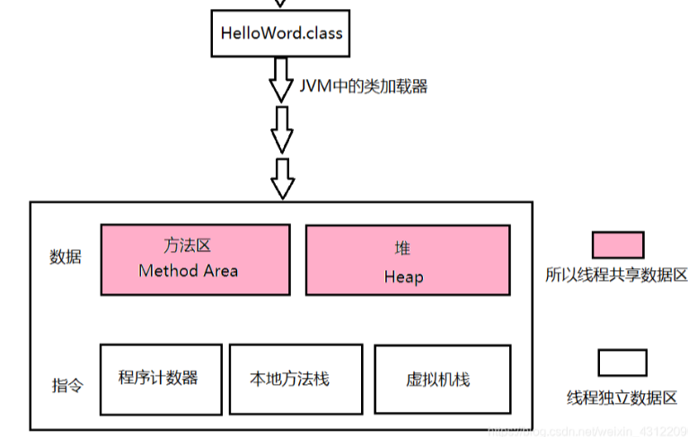
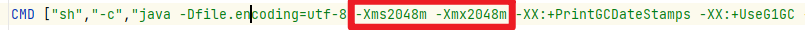
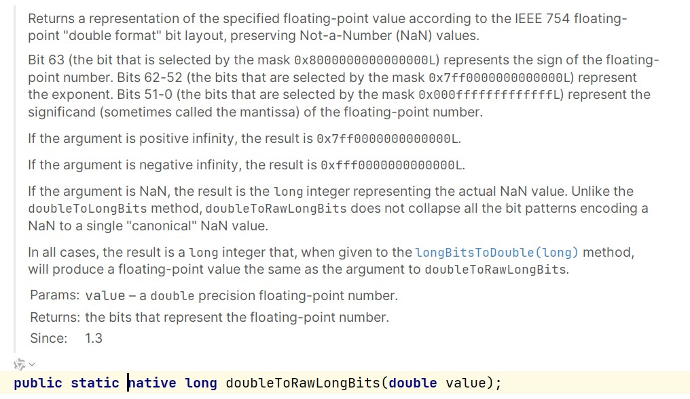
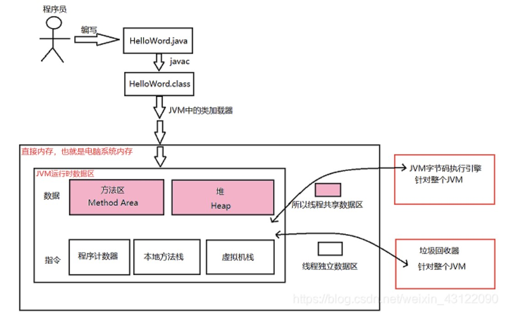

# JVM 入门

## 1.内存结构

### 1.1 jvm运行时数据区




1. 方法区

- 存储已被Java虚拟机加载的***类信息***、***常量***、***静态变量***、即时编译器编译后的代码等数据；

- 无法满足内存分配需求时，抛 **OutOfMemoryError异常**

  

2. 堆区

- 分配的内存最大，Java虚拟机规范中的描述：所有的***对象实例***以及***数组*** 都要在堆上分配;

- 垃圾收集器管理的主要区域，分为 **新生代**、**老年代**;

- 可通过配置 -Xmx 和 -Xms 控制

  

  - xmx:jvm可分配的最大堆内存
  - xms:jvm分配的初始堆内存

- 无可分配内存且无法再扩展时，抛 **OutOfMemoryError 异常**


3. 程序计数器(PC)

- 计算下一条需要执行的指令的地址；
- 没有规定 ***OutOfMemoryError*** ；


4. 虚拟机栈

- 方法执行时，创建栈帧（编译器用来实现方法调用所用的一种数据结构，包含局部变量、操作数栈、出口、动态链接等内容）
- 如果线程请求的栈深度大于虚拟机所允许的深度，将抛出 ***StackOverflowError*** 异常，创建栈帧若无法申请到足够内存时，抛 ***OutOfMemoryError 异常***


5. 本地方法栈

- 管理**本地方法**调用

  - 本地方法（非java语言实现，当接口使用即可）:

    - 追求效率
    - java不易实现
    - 与OS交互
    - 与java环境外交互
    - ......

    示例：





### 1.2 直接内存
JVM 外直接向操作系统申请的一部内存，主要目的是**提升IO读写性能**，且垃圾回收不管理直接内存，可以**避免GC干扰**

- 引入了一种基于 **通道(Channel)** 与 **缓冲区（Buffer）** 的I/O 方式，**使用 native 函数库 **直接分配数据区外内存，然后通过**DirectByteBuffer** 对象作为这块内存的引用进行操作，图示如下:


- 使用场景
    - NIO（New IO）：Java NIO 提供的 ByteBuffer.allocateDirect() 允许分配直接内存，避免 I/O 复制。
    - Netty：高性能网络框架 Netty 也大量使用直接内存来优化网络通信。
    - 数据库驱动（如 MySQL JDBC Driver）：某些数据库驱动（如 MySQL Connector）会使用直接内存加速数据传输。

- 与数据区区别:

  - 直接内存申请空间耗费很高的性能，堆内存申请空间耗费比较低
  - 直接内存的IO读写的性能要优于堆内存，在多次读写操作的情况相差非常明显
  - 不受GC影响，使用时需要手动释放内存

  示例代码 （同时展示直接内存操作方式）:

  ```
  package com.lijie;
  
  import java.nio.ByteBuffer;
  
  /**
   * 直接内存 与 堆内存的比较
   */
  public class ByteBufferCompare {
  
      public static void main(String[] args) {
          allocateCompare();   //分配比较
          operateCompare();    //读写比较
      }
  
      /**
       * 直接内存 和 堆内存的 分配空间比较
       */
      public static void allocateCompare() {
          int time = 10000000;    //操作次数
          long st = System.currentTimeMillis();
          for (int i = 0; i < time; i++) {
  
              ByteBuffer buffer = ByteBuffer.allocate(2);      //非直接内存分配申请
          }
          long et = System.currentTimeMillis();
          System.out.println("在进行" + time + "次分配操作时，堆内存：分配耗时:" + (et - st) + "ms");
          long st_heap = System.currentTimeMillis();
          for (int i = 0; i < time; i++) {
              ByteBuffer buffer = ByteBuffer.allocateDirect(2); //直接内存分配申请
          }
          long et_direct = System.currentTimeMillis();
          System.out.println("在进行" + time + "次分配操作时，直接内存：分配耗时:" + (et_direct - st_heap) + "ms");
      }
  
      /**
       * 直接内存 和 堆内存的 读写性能比较
       */
      public static void operateCompare() {
          //如果报错修改这里，把数字改小一点
          int time = 1000000000;
          ByteBuffer buffer = ByteBuffer.allocate(2 * time);
          long st = System.currentTimeMillis();
          for (int i = 0; i < time; i++) {
              buffer.putChar('a');
          }
          buffer.flip();
          for (int i = 0; i < time; i++) {
              buffer.getChar();
          }
          long et = System.currentTimeMillis();
          System.out.println("在进行" + time + "次读写操作时，堆内存：读写耗时：" + (et - st) + "ms");
          ByteBuffer buffer_d = ByteBuffer.allocateDirect(2 * time);
          long st_direct = System.currentTimeMillis();
          for (int i = 0; i < time; i++) {
              buffer_d.putChar('a');
          }
          buffer_d.flip();
          for (int i = 0; i < time; i++) {
              buffer_d.getChar();
          }
          long et_direct = System.currentTimeMillis();
          System.out.println("在进行" + time + "次读写操作时，直接内存：读写耗时:" + (et_direct - st_direct) + "ms");
      }
  }
  
  // -----------------------------结果---------------------------------
  //在进行10000000次分配操作时，堆内存：分配耗时:98ms
  //在进行10000000次分配操作时，直接内存：分配耗时:8895ms
  //在进行1000000000次读写操作时，堆内存：读写耗时：5666ms
  //在进行1000000000次读写操作时，直接内存：读写耗时:884ms
  
  ————————————————
  原文链接：https://blog.csdn.net/weixin_43122090/article/details/105093777
  ```


## 2.垃圾回收


