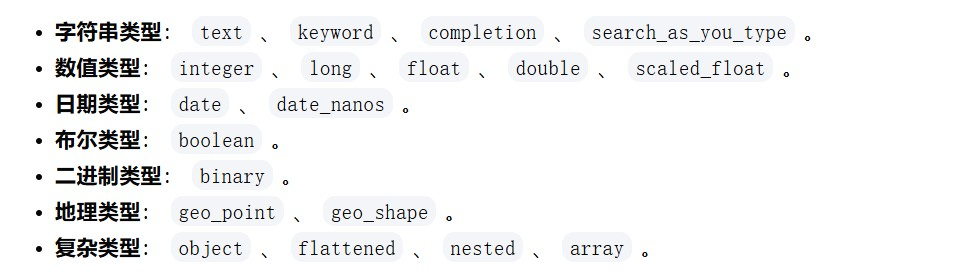

# es基础
## Lucene 全文搜索引擎
**分词->构建倒排索引->提供基本搜索功能**,可以理解为单机版的搜索引擎，提供基本的读写功能。写过程就是建索引，而读过程就是利用索引（倒排索引）结构高效检索的过程。

es基于lucene，进一步封装、抽象，通过 **shard** 实现分布式存储和搜索

## Elasticsearch基本概念
### 基于lucene的分布式近实时搜索平台
> 近实时原因：ES 通过异步机制处理数据的写入和索引，当提交一个索引时，数据会先写入内存缓冲区，然后通过 refresh 操作，生成一个 segment 将数据从内存缓冲区刷新到**文件系统缓存**，此时，才能检索到数据，之后会通过 fsync 操作落盘。
> 
> segment： Lucene 中的一个倒排索引文件，包含了文档的数据和索引信息
> 
> refresh：有es中的配置 refresh_interval，默认 1s 刷新一次，也会受到缓冲区大小影响

### 基本概念与关系型数据库对比
| Elasticsearch | MySQL |
| :--: | :--: |
| 索引(index) | 数据库 |
| 类型(type) | 数据表 |
| 文档(doc) | 一行记录 |
| 映射(mapping) | 表结构 |

- es7后弃用 type，仅用 _doc 作为一个索引的类型，因为许多 es 的设计是按照关系型数据库的思路设计的(如上表)，但是 MySQL 中数据表之间是相互独立的，而不同的 type 均依赖一个索引，由于 lucene 底层原因，会影响存储效率，具体如下文章
  CSDN：[一文读懂 elasticsearch 版本升级 type 的变化](https://blog.csdn.net/microGP/article/details/112793859)

### 倒排索引
分词对文档id的映射

    # deepseek生成的demo
    docs = [
        "hello world", 
        "python demo",
        "hello python"
    ]
    倒排索引：
    hello: [0, 2]
    world: [0]
    python: [1, 2]
    demo: [1]
    搜索 'hello': [0, 2]
    搜索 'python': [1, 2]
    搜索 'hello python': [0, 1, 2]

## 基本操作
### _cat
请求路径：https://{ip}:{port}/_cat/{operate}

    # 常用请求
    GET /_cat/nodes: 查看所有节点
    GET /_cat/health: 查看 es 健康状况
    GET /_cat/master: 查看主节点
    GET /_cat/indices: 查看所有索引

### DSL
#### 全部匹配 match_all
#### 匹配查询 match

    GET {index}/_search
    {
        "query": {
            "match": {
                "item": "match demo"
            }
        }
    }

查询为字符串时，全文检索；非字符串基本类型时，精确查询
> 全文检索：将检索条件进行分词匹配，最后按照相关性得分排序

#### 短语匹配 match_phrase
    GET {index}/_search
    {
        "query": {
            "match_phrase": {
                "item": "match phrase demo"
            }
        }
    }
检索条件不分词进行匹配

#### 多字段匹配 multi_match
    GET {index}/_search
    {
        "query": {
            "multi_match": {
                "query": "multi_match demo",  # 会分词查询
                "fields": [
                    "item1",
                    "item2"
                ]
            }
        }
    }
查询 item1、item2 中包含 multi_match demo、multi_match 或 demo 的文档

#### 复合查询 bool
常与别的查询嵌套构造复杂的查询条件

    GET {index}/_search
    {
        "query": {
            "bool": {
                "must": [
                    {
                        "match": {
                            "item": "demo"
                        }
                    }
                ]
            }
        }
    }

- must 必须符合
- must_not 必须不满足
- should 如果满足,类似 or 逻辑
- filter 满足该条件的记录

must、should会影响相关性得分，filter查询逻辑同must，但不影响相关性得分,具体查询区别如下：
    
    # 假设有一倒排索引如下
    hello: [0, 2, 3]
    world: [0]
    python: [1, 2]
    demo: [1]
    
    must搜索hello,计算相关性得分,文档[3]会排在最前面；
    filter搜索hello,若无其他排序条件,文档[0]会排在最前面

#### term 查询

    GET {index}/_search
    {
        "query": {
            "term": {
                "item": "term"
            }
        }
    }

> term 适合匹配存在精确值的字段,不适合对 text 类型字段做检索，text 类型字段在存储时会进行分词,在检索时，term中的检索条件如果无法与分词的信息保持一致,就无法检索出对应的文档,此时应用match进行检索。

#### aggregations 聚合查询
从数据中分组并提取数据，类似于MySQL中的 group by 和聚合函数

    # test环境 crm不同客户阶段的人数
    GET crm_t_customer/_search
    {
        "aggs": {
            "phaseAggr": {
                "terms": {
                    "field": "phase",
                    "size": 5    # 按照phase分组后，返回的数量
                }
            }
        },
        "size": 0      # 结果不返回命中的文档信息
    }
    
    # 结果, 展示不同客户阶段的客户数量
    {
        "took": 138,
        "timed_out": false,
        "_shards": {
            "total": 1,
            "successful": 1,
            "skipped": 0,
            "failed": 0
        },
        "hits": {
            "total": {
                "value": 10000,
                "relation": "gte"
            },
            "max_score": null,
            "hits": []
        },
        "aggregations": {
            "phaseAggr": {
                "doc_count_error_upper_bound": 0,
                "sum_other_doc_count": 37,
                "buckets": [
                    {
                        "key": 0,
                        "doc_count": 2177935
                    },
                    {
                        "key": 5,
                        "doc_count": 48425
                    },
                    {
                        "key": 1,
                        "doc_count": 41337
                    },
                    {
                        "key": 6,
                        "doc_count": 1109
                    },
                    {
                        "key": 2,
                        "doc_count": 287
                    }
                ]
            }
        }
    }

### 映射
定义文档中字段的数据类型

数据类型如上, 取自kimi, 官方文档如下：
[官方文档-ES数据类型](https://www.elastic.co/guide/en/elasticsearch/reference/7.17/mapping-types.html)

## 分页方式 (深分页问题)
> 注：scroll、search_after 均不支持跳页，所以在跳转较深的页时，比如有的分页可以输入跳转，不适合用 search_after 进行分页。
> 
> 用 search_after 进行深分页时，可以通过缓存后几页游标的方式实现小幅度跳页，或者通过某些事先知道排序值的字段，手动计算sort值，实现跳页
### from size 浅分页
> 原理：es基于shard，比如 from=0，size=10 时，会从多个 shard 中均取出10条数据，最终选择 10 条数据

该分页原理导致深分页时，性能影响会很大，且 from size 分页查询不能超过 es 配置 **max_result_windows** (默认10000)
当分页查询文档超过该值，会报错，可以通过扩大该值, 继续用 from_size 查询，但数据量大后会 OOM (以前 CRM 这么干过)

    PUT demo/_settings
    { 
        "index" : { 
            "max_result_window" : 20000
        }
    }
### scroll 深分页
> 原理：每次只能查询一页的内容, 并且返回一个scroll_id, 根据返回的 scroll_id 获取下一页的信息

使用 scroll 时必须将 from 设置为 0

### search_after 深分页
适用于**实时查询、顺序翻页**场景，在 5.0 版本之后才能够使用
> 根据上一页的最后一条数据来确定下一页的位置，同时在分页请求的过程中，如果有索引数据的增删改查，这些变更也会实时的反映到游标上

根据该原理可以看出，每一页的数据依赖于上一页最后一条数据，所以 **无法跳页** ，使用 search_after 的时候要将 **from 置为 0 或 -1**, 使用时，from常被隐式忽略，默认from=0

展示一个博客园的demo：
    
    POST twitter/_search
    {
        "size": 10,
        "query": {
            "match" : {
                "title" : "es"
            }
        },
        "sort": [
            {"date": "asc"},
            {"_id": "desc"}
        ]
    }
    
    # 返回的结果
    {
          "took" : 29,
          "timed_out" : false,
          "_shards" : {
            "total" : 1,
            "successful" : 1,
            "skipped" : 0,
            "failed" : 0
          },
          "hits" : {
            "total" : {
              "value" : 5,
              "relation" : "eq"
            },
            "max_score" : null,
            "hits" : [
              {
                ...
                },
                "sort" : [
                  ...
                ]
              },
              {
                ...
                },
                "sort" : [
                  124648691,
                  "624812"
                ]
              }
            ]
          }
        }
    
    # 上面的请求会为每一个文档返回一个包含sort排序值的数组。
    # 这些sort排序值可以被用于 search_after 参数里以便抓取下一页的数据。
    # 比如，我们可以使用最后的一个文档的sort排序值，将它传递给 search_after 参数：
    
    GET twitter/_search
    {
        "size": 10,
        "query": {
            "match" : {
                "title" : "es"
            }
        },
        "search_after": [124648691,"624812"],
        "sort": [
            {"date": "asc"},
            {"_id": "desc"}
        ]
    }

search_after 的正确用法
1. 首次查询：不设置 search_after，默认返回第一页（from=0），同时返回每条结果的 sort 数组。
2. 后续查询：将前一页最后一条的 sort 数组值作为 search_after 参数，继续获取下一页。
3. 排序一致性：必须保证所有分页请求的 sort 字段和顺序完全一致，否则分页会错乱。

 
