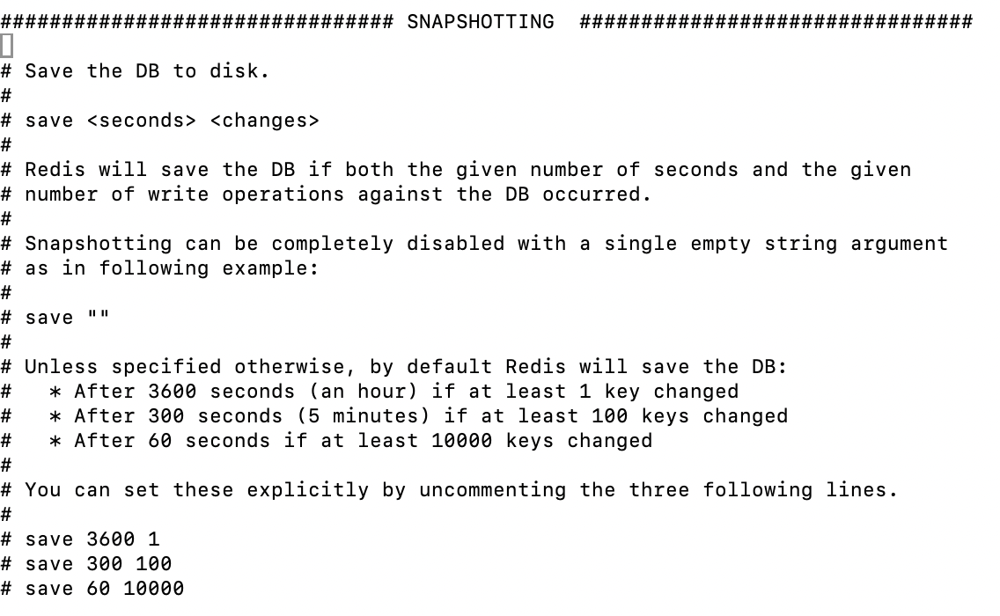

# Redis
## redis的单线程与高性能
单线程：
- redis的网络IO和键值对读写由一个线程来完成；
    > 小心使用redis指令，对于耗时的指令（比如keys），会直接导致redis卡顿
- 其他功能如：持久化、异步删除、集群数据同步等，由额外线程完成；

高性能：
> 本地安装的redis，通过redis-benchmark，可达到 23w qps
- 所有数据在内存，内存级别运算；
- 单线程避免多线程的切换

> 单线程 redis 是如何处理并发网络请求？
> 利用epoll实现IO多路复用，将连接信息和事件放到队列中，依次放到文件事件分派器，事件分派器将事件分发给事件处理器 

## 持久化
### RDB
根据配置的节点，直接将内存中的内容写到dump.rdb文件中，通过redis.conf文件中的配置，例如：save 60 10000（60s内有10000条数据，同步一次rdb文件）

save vs. bgsave
 